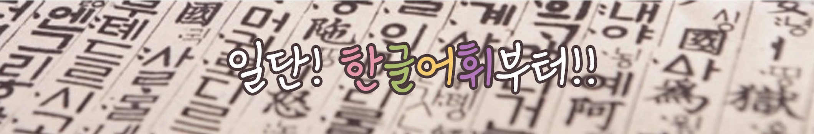

# 어휘력

## 1. 문과 언니: 어휘력, 상식 퀴즈 

## 2. 한글어휘

- <a href="https://www.youtube.com/watch?v=ERSvKVguOl0&list=PLJVNgCEQC0ppHSBM2-RiqrAbmpQOBq1tE" target='_blank'>수능국어 심화어휘</a>
- <a href="https://www.youtube.com/watch?v=ZNP30FMOVRY&list=PLJVNgCEQC0ppio_2WBKfh0rKJcSlRL19s" target='_blank'>중등사자성어</a>
- <a href="https://www.youtube.com/playlist?list=PLJVNgCEQC0pq928vfj_Ou98UtoK9gGXAV" target='_blank'>한국교육과정평가원 교과 문해력 향상을 위한 사고도구어 335
</a>

## 3. HANIJEMI ; KOREAN LESSON

- <a href="https://www.youtube.com/playlist?list=PLZLv4OTjRNkjCZPgBHWeQnQuo1EQOhwWh" target='_blank'>한자어 어휘</a>
- <a href="https://www.youtube.com/playlist?list=PLZLv4OTjRNkh1QGRUP_hZaV0CJiQffiFO" target='_blank'>한국어 속담</a>